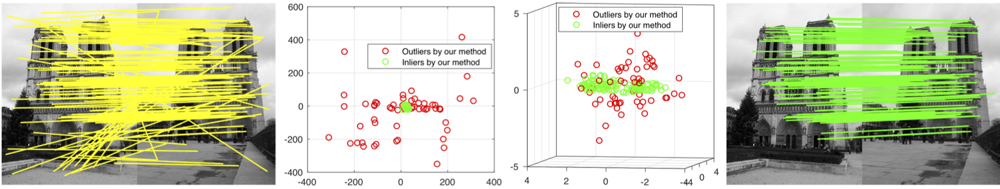
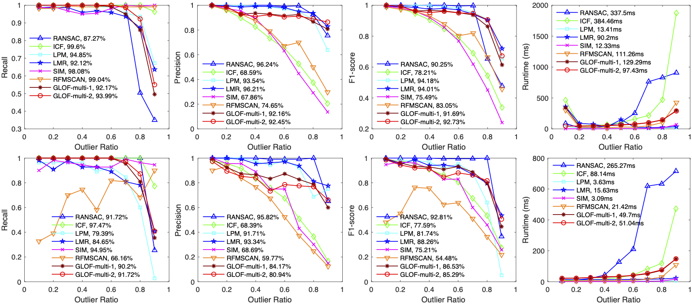
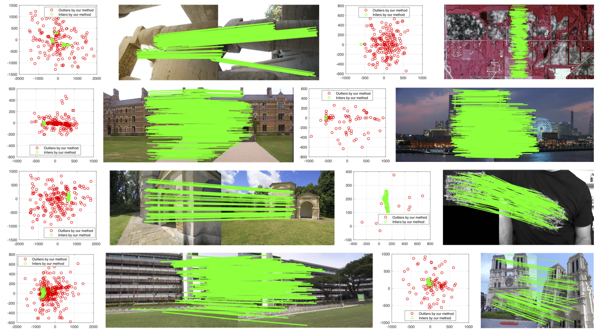

## GLOF: Robust feature matching using guided local outlier factor

A MATLAB implementation of the Guided Local Outlier Factor (GLOF) method for removing mismatches in image feature matching. (The python implemnetation [GLOF_python](GLOF_python/readme.md))

	@article{wang2021robust,
	  title={Robust feature matching using guided local outlier factor},
	  author={Wang, Gang and Chen, Yufei},
	  journal={Pattern Recognition},
	  volume={117},
	  pages={107986},
	  year={2021},
	  publisher={Elsevier}
	}
	

